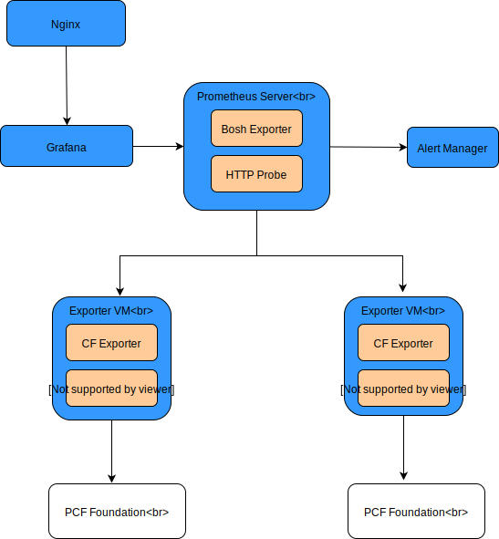

## Pre-requisites:
A working Bosh environment with UAA.

## Design Diagram:


## How to set up the monitoring
### Step 1:
The bosh_exporter client is required in order to discover the foundations that are being monitored. This enables foundations to be added, deleted, or modified, without having to manually tell prometheus about the new target. In order to make thie work, a bosh_exporter client, on the bosh director, is required.

It is recommended to create a bosh_exporter UAA client with "refresh_token" grant type:
```
    client_id: bosh_exporter
    authorized-grant-types: client_credentials,refresh_token
    authorities: bosh.read
    scope: bosh.read
```
Without refresh_token grant type, a UAA client may expire and therefore cause the outage of the monitoring.

You may add an ops file for creating bosh_exporter UAA account.  A sample ops file (add-bosh-exporter-uaa-clients.yml) can be found at the ops directory.  If the bosh director is created by BBL, add a "create-director-override.sh" file in the same directory as for the default "create-director.sh" file to add the ops file. Note: This ops file is for the bosh director, NOT for prometheus.

To manually create the client, following [this process](https://docs.pivotal.io/pivotalcf/2-3/customizing/opsmanager-create-bosh-client.html) for logging into the UAA on the bosh director. Then manually create the client:

```
uaac client add bosh_exporter --scope bosh.read --authorities bosh.read --authorized_grant_types client_credentials,refresh_token
```

### Step 2:
Run ```./create-exporter-uaa.sh``` to generate the UAA clients for cf and firehose exporters for the PCF foundations to be monitored.  Access to the cloud controller and doppler endpoints are the only requirements on the PCF side.
### Step 3:
Run ```./init-config.sh``` to create the "prometheus-params.yml" and "prometheus-exporter-ops.yml" files.
### Step 4:
Update the generated "prometheus-params.yml" file for required parameters, such as bosh connection info, etc.  A sample "sample-prometheus-params.yml" file is provided as a reference.  No changes are required for the "prometheus-exporter-ops.yml" file.
### Step 5:
Log in bosh environment and run ```./prometheus.sh``` to kick off the deployment.  Optionally, you can update the ops file to fit your specific requirements.

This project also comes with 2 additional dashboads, under the "dashboard" folder, which you can import to grafana.

## How to add additional PCF foundations to an existing environment
### Step 1:
Run ```./create-exporter-uaa.sh``` to generate the UAA clients for cf and firehose exporters.
### Step 2:
Run ```./add-pcf.sh``` to add more PCF foundations to the monitoring. This script will append necessary contents to the existing "prometheus-exporter-ops.yml" and "prometheus-params.yml" files.
### Step 3: 
Updated the "prometheus-params.yml" file for any additional parameters required.
### Step 4:
 Log in bosh and run ```./prometheus.sh```.
